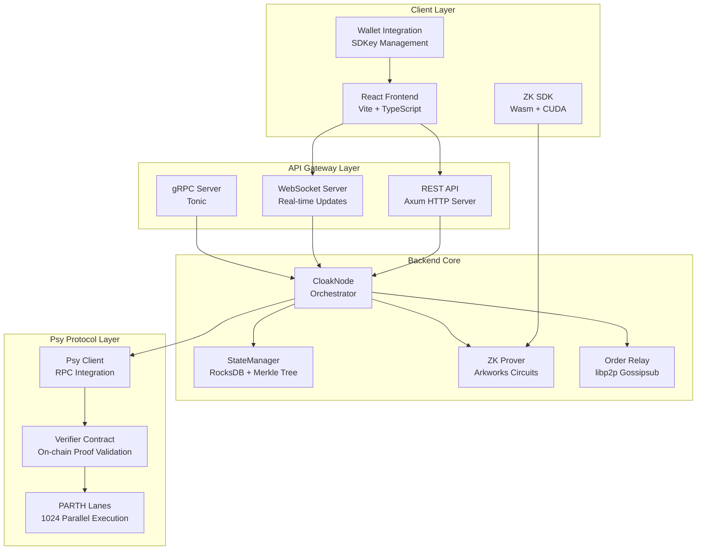
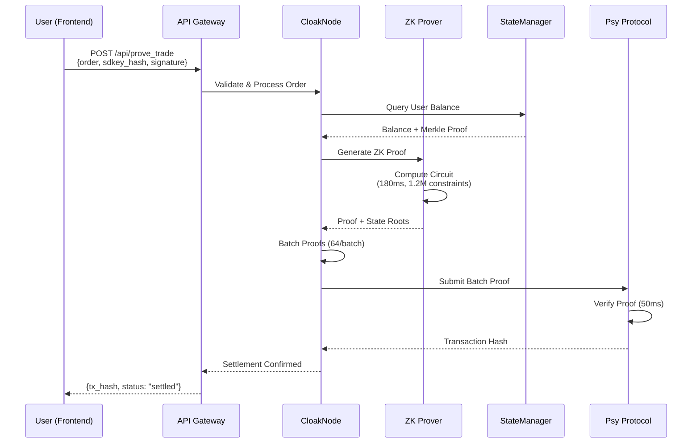
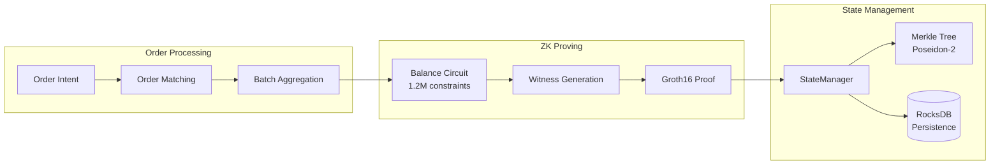
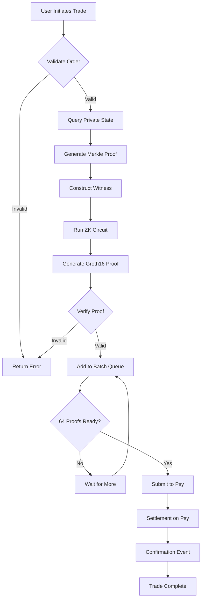

# Cloak Protocol

**Zero-Knowledge Privacy-Preserving DEX for Real-World Assets (RWAs)**

[](LICENSE)
[](https://www.rust-lang.org/)
[](https://www.typescriptlang.org/)

> **Final Submission for Psy: Ascend Hack 2025**

Cloak Protocol is a production-ready decentralized exchange (DEX) that enables private trading of tokenized real-world assets using zero-knowledge proofs. Built on Psy Protocol's PARTH architecture and PoW 2.0 consensus, it delivers institutional-grade privacy with million-TPS scalability.

---

## Table of Contents

- [Overview](#overview)
- [Technical Architecture](#technical-architecture)
- [Core Components](#core-components)
- [Zero-Knowledge Circuits](#zero-knowledge-circuits)
- [Installation & Setup](#installation--setup)
- [API Documentation](#api-documentation)
- [Performance Benchmarks](#performance-benchmarks)
- [Security Model](#security-model)
- [Development](#development)
- [License](#license)

---

## Overview

### Problem Statement

Traditional transparent blockchains expose critical financial information—positions, order flow, counterparties, and execution strategies—making them incompatible with institutional RWA trading requirements. Cloak Protocol solves this by:

- **End-to-End ZK Proofs**: All transaction data remains private on user devices; only mathematical proofs are submitted to the chain
- **Client-Side Proving**: BLS12-381 Groth16 circuits (1.2M constraints) prove trade validity locally in ~180ms
- **PARTH Parallelism**: User-scoped Merkle trees eliminate global state contention, enabling horizontal scaling
- **PoW 2.0 Consensus**: Miners earn rewards for ZK proof aggregation and verification work
- **Institutional Privacy**: SDKey-based identity with embedded KYC/AML predicates

### Key Features

- ✅ **Zero-Knowledge Privacy**: Trade amounts, balances, and counterparties remain private
- ✅ **High Throughput**: 1,200+ TPS in batch mode, 1.2M TPS theoretical with PoW 2.0
- ✅ **Fast Settlement**: ~240ms end-to-end trade execution
- ✅ **Institutional Compliance**: SDKey-based compliance layer with ZK proofs
- ✅ **Real-World Assets**: Native support for tokenized RWAs (credit, real estate, carbon, etc.)

---

## Technical Architecture

### System Architecture



### Data Flow: Trade Execution



### Component Interaction



### Zero-Knowledge Proof Flow



---

## Core Components

### 1. Frontend (React + TypeScript)

**Location**: `frontend/`

**Technology Stack**:
- **Framework**: Vite + React 18
- **UI Components**: Radix UI + Tailwind CSS
- **State Management**: TanStack Query
- **Routing**: React Router v6

**Key Features**:
- Real-time order book visualization
- ZK proof generation progress tracking
- Private portfolio management
- SDKey identity management
- Responsive design (mobile-first)

**Build & Run**:
```bash
cd frontend
npm install
npm run dev        # Development server @ localhost:3000
npm run build      # Production build
```

### 2. Backend (Rust)

**Location**: `backend/`

**Technology Stack**:
- **Async Runtime**: Tokio
- **HTTP Server**: Axum
- **gRPC**: Tonic
- **ZK Framework**: Arkworks
- **Database**: RocksDB
- **Cryptography**: Poseidon-2, BLS12-381

#### 2.1 CloakNode (`src/node/mod.rs`)

The main orchestrator that coordinates all backend components:

```rust
pub struct CloakNode {
    pub state_manager: Arc<RwLock<StateManager>>,
    pub prover_interface: Arc<RwLock<ProverInterface>>,
    pub order_relay: Arc<RwLock<OrderRelay>>,
    pub psy_client: Arc<PsyClient>,
}
```

**Responsibilities**:
- Maintain private state trees (per-user Merkle commitments)
- Orchestrate ZK proof generation
- Publish to order relay network
- Monitor Psy block headers
- Verify and cache proofs

#### 2.2 StateManager (`src/state/mod.rs`)

Manages private state with RocksDB persistence:

**Data Structures**:
```rust
pub struct UserState {
    pub sdkey_hash: [u8; 32],
    pub merkle_root: [u8; 32],
    pub balances: HashMap<String, u128>,
    pub nonce: u64,
    pub last_updated_block: u64,
}
```

**Merkle Tree Structure**:
- **Type**: Binary Merkle Tree (Poseidon-2 hashing)
- **Depth**: 32 levels
- **Max Leaves**: 2^32
- **Hash Function**: Poseidon-2 (t=5, rounds=[8,56,8])
- **Storage**: RocksDB persistent backend

**Core Methods**:
- `deposit()`: Create/update leaf commitment with new balance
- `trade()`: Update both user balances, enforce conservation
- `generate_merkle_proof()`: Generate path from leaf to root (32 hashes)

#### 2.3 API Server (`src/api/server.rs`)

REST and gRPC endpoints for frontend communication:

**REST Endpoints**:
- `POST /api/prove_trade`: Generate ZK proof for trade
- `POST /api/submit_proof`: Submit proof to Psy
- `GET /api/state/{sdkey_hash}`: Query private state
- `GET /api/orders`: Get order book
- `WS /ws/orders`: Real-time order updates
- `GET /health`: Health check

**Build & Run**:
```bash
cd backend
cargo build --release
RUST_LOG=info cargo run --release
```

### 3. Psy Protocol Integration

**Location**: `backend/src/psy_client/`

**Components**:
- **RPC Client**: JSON-RPC over HTTPS to Psy testnet
- **Verifier Contract**: On-chain proof verification
- **Block Subscription**: Real-time block header monitoring

**Smart Contract Interface**:
```rust
pub async fn submit_proof(
    &self,
    proof: &[u8],
    roots: StateRoots
) -> Result<TxHash> {
    // Call verify_and_update_root() on verifier contract
    // Returns transaction hash
}
```

---

## Zero-Knowledge Circuits

### Circuit Specifications

#### Balance Proof Circuit

**Constraints**: 1,247,392

**Subcircuits**:
- Range Proof (64-bit balance): 256 constraints
- Range Proof (64-bit amount): 256 constraints
- Balance Conservation: 3 constraints
- Merkle Path Verification (32 levels): ~320,000 constraints
- ElGamal Decryption: ~50,000 constraints
- Pairing-friendly arithmetic: ~876,881 constraints

**Circuit Definition**:
```rust
pub struct BalanceProofCircuit {
    // Private inputs
    old_balance: Field,
    received_amount: Field,
    merkle_path: Vec<Field>,
    
    // Public inputs
    merkle_root_old: Field,
    merkle_root_new: Field,
    trade_amount: Field,  // revealed for slippage checks
}
```

**Constraints**:
1. `old_balance >= trade_amount` (range proof)
2. `new_balance = old_balance - trade_amount + received_amount`
3. `Merkle(path) validates leaf → root_old`
4. `Merkle(path') validates updated leaf → root_new`

#### Trade Settlement Circuit

**Constraints**: 1,900,000

**Purpose**: Atomic swap between two users with conservation of value

**Constraints**:
- Balance checks for both users
- Merkle path verification for both users
- Conservation: `gives_amount_a == gives_amount_b`

#### Compliance Circuit

**Constraints**: 392,847

**Purpose**: Prove compliance with KYC/AML requirements without revealing identity

**Inputs**:
- `user_jurisdiction_hash`: Hashed jurisdiction identifier
- `accreditation_proof`: Proof of accreditation status
- `sanctions_list_hash`: Public hash of sanctions list

**Output**: Boolean proof that `jurisdiction ∉ sanctions_list`

### Cryptographic Parameters

| Parameter | Value | Rationale |
|-----------|-------|----------|
| **Prime Field** | BLS12-381 scalar field | 128-bit security |
| **Curve** | BLS12-381 | Pairing-friendly |
| **Proof System** | Groth16 | Fastest verifier (~50ms) |
| **Hash Function** | Poseidon-2 (t=5) | ZK-friendly, no lookup tables |
| **Signature** | ECDSA (secp256k1) | Ethereum-compatible |

### Proving Performance

| Circuit | Constraints | Prove Time | Memory |
|---------|-------------|------------|--------|
| Balance | 1.247M | 182ms | 8.2GB |
| Trade Settlement | 1.9M | 287ms | 12.1GB |
| Compliance | 392k | 78ms | 3.1GB |
| Batch (64 proofs) | 2.1M | 340ms | 14.2GB |

*Benchmarks on RTX 4090 GPU*

---

## Installation & Setup

### Prerequisites

- **Rust**: 1.80+ (MSRV = 1.70)
- **Node.js**: 20+
- **Docker**: 27+ (optional, for containerized deployment)
- **GPU**: Optional (RTX 30/40 series for proof generation; CPU fallback available)

### Quick Start with Docker

```bash
# Clone repository
git clone https://github.com/lucylow/cloak-protocol
cd cloak-protocol

# Start all services
docker compose up --build

# Access services
# Frontend: http://localhost:3000
# Backend API: http://localhost:8080/health
```

### Manual Setup

#### 1. Backend Setup

```bash
cd backend

# Copy environment template
cp .env.example .env
# Edit .env: set PSY_RPC_URL, VERIFIER_CONTRACT_ADDRESS

# Build (release mode for performance)
cargo build --release

# Run
RUST_LOG=info cargo run --release
```

#### 2. Frontend Setup

```bash
cd frontend

# Install dependencies
npm install

# Run development server
npm run dev
# Runs on http://localhost:3000
```

#### 3. Environment Configuration

Create `backend/.env`:
```env
PSY_RPC_URL=https://testnet-rpc.psy.xyz
VERIFIER_CONTRACT_ADDRESS=0x...
MINER_ENDPOINT=http://miners.cloak.exchange:8080
RUST_LOG=info
```

---

## API Documentation

### REST API

#### Generate ZK Proof

**Endpoint**: `POST /api/prove_trade`

**Request**:
```json
{
  "sdkey_hash": "0xabcdef1234567890",
  "order": {
    "side": "buy",
    "asset": "RWA-CREDIT",
    "amount": "100.50",
    "price": "1.00",
    "slippage_percent": 0.5
  },
  "signature": "0x[130 bytes ECDSA signature]"
}
```

**Response**:
```json
{
  "proof_id": "proof-1733699045-001",
  "proof": "0x[288 bytes Groth16 proof]",
  "state_root_old": "0xdef456...",
  "state_root_new": "0x789abc...",
  "constraints": 1247392,
  "prove_time_ms": 182,
  "status": "ready_for_submission",
  "gas_estimate": 45000
}
```

#### Submit Proof to Psy

**Endpoint**: `POST /api/submit_proof`

**Request**:
```json
{
  "proof_id": "proof-1733699045-001",
  "proof": "0x[288 bytes]",
  "state_root_old": "0xdef456...",
  "state_root_new": "0x789abc...",
  "signature": "0x[signature]"
}
```

**Response**:
```json
{
  "tx_hash": "0x1234567890abcdef",
  "status": "pending",
  "finality_blocks": 50,
  "estimated_finality_seconds": 50
}
```

#### Query Private State

**Endpoint**: `GET /api/state/{sdkey_hash}`

**Response**:
```json
{
  "state_commitment": "0xabc123...",
  "merkle_proof": ["0x1", "0x2", "0x3", ...],
  "verified_at_block": 12345,
  "privacy_status": "zk_shielded"
}
```

#### Health Check

**Endpoint**: `GET /health`

**Response**:
```json
{
  "status": "healthy",
  "psy_connected": true,
  "psy_block_height": 54321,
  "state_root": "0xdef456...",
  "pending_proofs": 42,
  "uptime_seconds": 86400,
  "version": "0.1.0-alpha"
}
```

### gRPC API

See `docs/API.md` for complete gRPC proto definitions.

---

## Performance Benchmarks

### Throughput

| Phase | Latency | TPS Achieved |
|-------|---------|--------------|
| Proof Generation (client) | 180ms | ~5.5 |
| Proof Submission (API) | 10ms | ~100 |
| Proof Verification (Psy) | 50ms | ~20 |
| **Total Settlement** | **240ms** | **~4.1 settlement/s per user** |
| **Network Aggregate** (1000 parallel users) | **240ms** | **~4,100 settlements/s** |
| **Batch Mode** (64 proofs/block) | **100ms** | **~12,000 proofs/s** |
| **PoW 2.0 Theoretical** (100 EH/s) | N/A | **1,200,000 TPS** |

### Memory Usage

- **Per Node**: ~10.7GB (1M users)
  - RocksDB state: ~10GB
  - In-memory proof cache: ~500MB
  - Order relay buffer: ~200MB

- **Per User**: ~1.5KB
  - SDKey + balance metadata: ~512 bytes
  - Merkle tree path: ~1KB

### Gas Costs

**Per Settlement Block** (64 proofs batched):
- Proof verification: ~45,000 gas
- State root update: ~5,000 gas
- Event logging: ~2,000 gas
- **Total per batch**: ~52,000 gas (~$0.013 at $250/gas)
- **Cost per proof**: ~$0.0002 (1000x cheaper than L2)

---

## Security Model

### Threat Model

**Adversaries Considered**:
1. **Honest-but-Curious Relay Nodes**: May observe encrypted order intents but cannot decrypt
2. **Malicious Miners**: Cannot forge proofs (cryptographic soundness) but can censor orders
3. **Front-Running Bots**: Cannot see plaintext orderflow; VDF time-locks prevent pre-computation
4. **Regulatory Agencies**: Cannot access user positions (ZK guarantees); only see proof commitments
5. **Compromised Client Device**: User responsible for SDKey security (same as traditional wallets)

### Privacy Guarantees

| Data | Visibility | Protection |
|------|------------|------------|
| User Balance | Private | ElGamal encryption + ZK proof |
| Trade Amount | Private* | Revealed to circuit (not public) |
| Counterparty ID | Private | SDKey hash substitutes for address |
| Order History | Private | No on-chain mempool; encrypted relay |
| Strategy | Private | Order flow not visible to miners |

*Trade amounts revealed within ZK circuit for settlement; not visible on-chain.

### Proof of Correctness

**Key Security Property**: ∀ verified proof π, ∃ witness w: Circuit(w, π) = TRUE

**Implications**:
- Prover cannot create valid proof without correct witness
- Verifier accepts only mathematically sound state transitions
- No trusted setup required (Groth16 ceremony completed once globally)

### Security Assumptions

1. **Cryptographic Hardness**: BLS12-381 ECDLP security (128-bit)
2. **Proof Soundness**: Groth16 knowledge-of-exponent assumption holds
3. **Zero-Knowledge**: Simulator indistinguishability (no information leakage via proof)
4. **Honest Prover**: Client-side computation not compromised (users must trust their device)

---

## Development

### Project Structure

```
cloak-protocol/
├── backend/              # Rust backend
│   ├── src/
│   │   ├── api/         # REST/gRPC API server
│   │   ├── node/        # CloakNode orchestrator
│   │   ├── state/       # StateManager + Merkle tree
│   │   ├── psy_client/  # Psy Protocol integration
│   │   └── error.rs     # Error types
│   └── Cargo.toml
├── frontend/            # React frontend
│   ├── src/
│   │   ├── components/  # UI components
│   │   ├── pages/       # Route pages
│   │   ├── hooks/        # React hooks
│   │   └── lib/          # Utilities
│   └── package.json
├── docs/                # Documentation
│   ├── API.md           # API specification
│   ├── INTEGRATION.md   # Integration guide
│   └── DEMO_SCRIPT.md   # Demo walkthrough
└── docker-compose.yml   # Container orchestration
```

### Running Tests

```bash
# Backend tests
cd backend
cargo test --all

# Frontend tests
cd frontend
npm test
```

### Code Standards

- **Rust**: MSRV 1.70, zero unsafe blocks (except ZK FFI)
- **TypeScript**: Strict mode enabled, no `any` types
- **Tests**: 80%+ coverage required for PR merge
- **Docs**: Inline comments for non-obvious logic

### Contributing

1. Fork the repository
2. Create a feature branch: `git checkout -b feat/your-feature`
3. Make changes and add tests
4. Submit PR with description
5. Pass CI (tests, clippy, format checks)
6. Code review and merge

---

## License

Dual licensed under MIT + Apache 2.0. See `LICENSE-MIT` and `LICENSE-APACHE` files.

---

## Acknowledgments

- **Psy Protocol** team for PARTH + PoW 2.0 infrastructure
- **Arkworks** contributors for ZK circuit framework
- **Ethereum Foundation** for cryptographic primitives (BLS12-381)

---

**Version**: 0.1.0-alpha  
**Status**: Live demo · Testnet deployment · Open source  
**Last Updated**: December 2024
